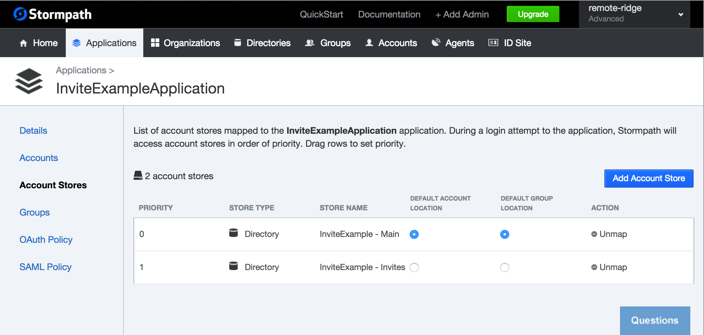
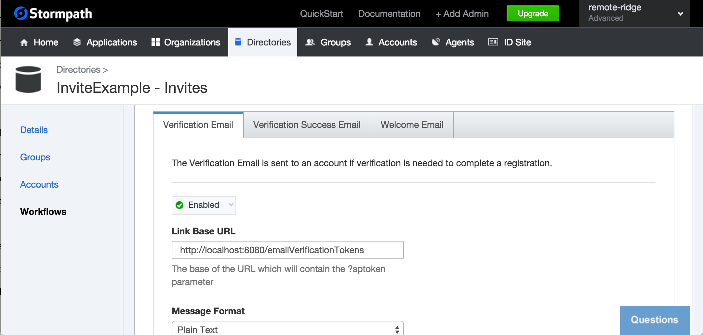
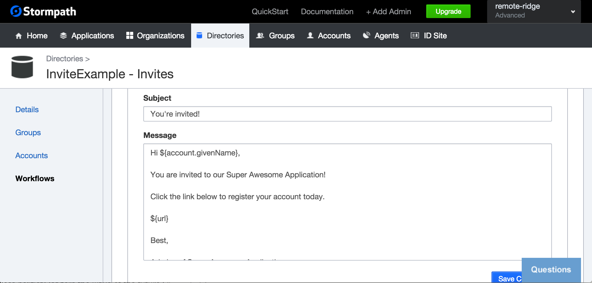

#Stormpath is Joining Okta
We are incredibly excited to announce that [Stormpath is joining forces with Okta](https://stormpath.com/blog/stormpaths-new-path?utm_source=github&utm_medium=readme&utm-campaign=okta-announcement). Please visit [the Migration FAQs](https://stormpath.com/oktaplusstormpath?utm_source=github&utm_medium=readme&utm-campaign=okta-announcement) for a detailed look at what this means for Stormpath users.

We're available to answer all questions at [support@stormpath.com](mailto:support@stormpath.com).

## Spring Boot Invite Example

There are times when you want to invite users to your application. This repo walks you through doing just that with a
Spring Boot Application.

**Note**: It is assumed that you are familiar with the basics of working with Stormpath. 
Check out our [Product Guide](https://docs.stormpath.com/rest/product-guide/latest/) for more information.

### Setup

This example uses an approach that involves two Directories:

* One used for invited Accounts; We'll call it: `InviteExample - Invites`
* One used for active, registered accounts; We'll call it: `InviteExample - Main`

`InviteExample - Main` will be the `Default Account Location` for the Application.

Here's the invitation flow:

* Hit an endpoint in your Spring Boot application to invite a user.
* The invited user receives an email with a link. The link hits another endpoint in your Spring Boot application and
  passes in the verification token.
* When the link is clicked, your Spring Boot application verifies that token. This has the side effect of transitioning
  the account in the `InviteExample - Invites` Directory from `unverified` to `enabled`
* After the token is verified, the invited user is redirected to `/register`
* Since the `InviteExample - Main` Directory is the Default Account Location for the Spring Boot application, when the
  user registers, their Account will be in this Directory.
* Note: If Email Verification is enabled on the `InviteExample - Main` Directory, the user will receive another email
  when they register to verify their account.

This is what it looks like in the Application definition:



We'll alter some defaults in the `InviteExample - Invites` Directory:

* Enable the `Verification Email` Workflow
* Customize the `Link Base URL`
* Customize the verification email template

We will point the `Link Base URL` to *your* Spring Boot application as shown below. For the purposes of this example,
`http://localhost:8080/emailVerificationTokens`.

The purpose of customizing the verification email, is that it will be sent to invited users when they are invited.





### The Code

The key to this approach is that the `InviteController` is configured with the `inviteDirectory`.

```
@Value("#{ @environment['stormpath.invite.directory.href'] }")
String inviteDirectoryHref;

@PostConstruct
void postConstruct() {
    inviteDirectory = client.getResource(inviteDirectoryHref, Directory.class);
}
```

Invited Accounts are created in this Directory. This is shown in the `invite` method below.

```
@RequestMapping("/invite")
public String invite(
    @RequestParam String email, @RequestParam String givenName, @RequestParam String surName, Model model
) {
    Account account = client.instantiate(Account.class);

    account
        .setEmail(email)
        .setGivenName(givenName)
        .setSurname(surName)
        .setPassword("A0" + UUID.randomUUID().toString());

    inviteDirectory.createAccount(account);

    model.addAttribute("email", email);

    return "invite_confirm";
}
```

*Note*: It would not be very efficient to invite people in bulk this way. The method above could easily be replaced with
a method that receives and parses a CSV file or some other formatted file for bulk processing.

Line 13 above is the key - `inviteDirectory.createAccount(account)`. It creates the Account in the 
`InviteExample - Invites` Directory.

Here's the secret sauce: Because of the enabled Email Verification Workflow on the Directory, the user will receive the 
invite email template at the specified email address.

A random password is set on the Account. It is not intended that the user will ever login using this account. The 
`A0` is prepended to conform to the default password rules for Stormpath Directories.

Browsing to `/invite` endpoint like so: 
`http://localhost:8080/invite?email=micah%2Buser1%40stormpath.com&givenName=Micah&surName=Silverman` 
would cause `micah+user1@stormpath.com` to be invited.

*Note*: For this example, make sure you url encode the email address you pass in.

When the user clicks on the link in the email, it hits your Spring Boot application:

```
@RequestMapping("/emailVerificationTokens")
public String verify(@RequestParam String sptoken) {
    client.verifyAccountEmail(sptoken);

    // if we are here, the account is verified, proceed with registration

    return "redirect:/register";
}
```

Calling `client.verifyAccountEmail(sptoken)` transitions that Account from `unverified` to `enabled` in the 
`InviteExample - Invites` Directory. The last line redirects the user to `/register`. The Account they create when
they register will be in the `InviteExample - Main` Directory.

One of the benefits of this approach is that you can easily tell which of the invited users have not "accepted" the 
invitation by which Accounts in the `InviteExample - Invites` Directory are still `unverified`.